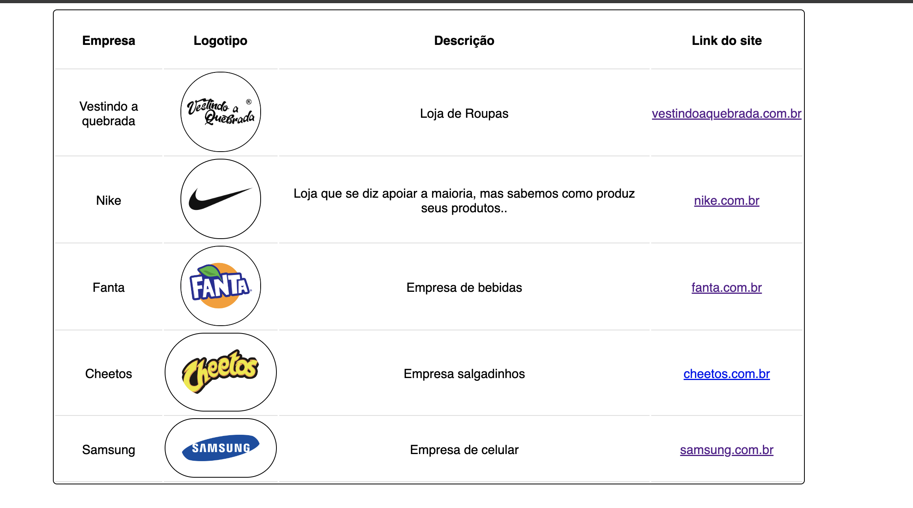

# Tabelas - Empresas

---

## Sobre

Site do tipo tabela para mostrar algumas empresas de diversos ramos. O objetivo desse projeto é colocar em pratica os conhecimentos adquiridos sobre linguagens de marcação, durante o curso de desenvolvimento de sistema do [SENAI JANDIRA](https://sp.senai.br/unidade/jandira)

---

## Tecnologias utilizadas
- HTML
- CSS
- MARKDOWN
- GIT

## Autor

- [Israel Junior](https://www.linkedin.com/in/israel-junior-0a48742b0/)